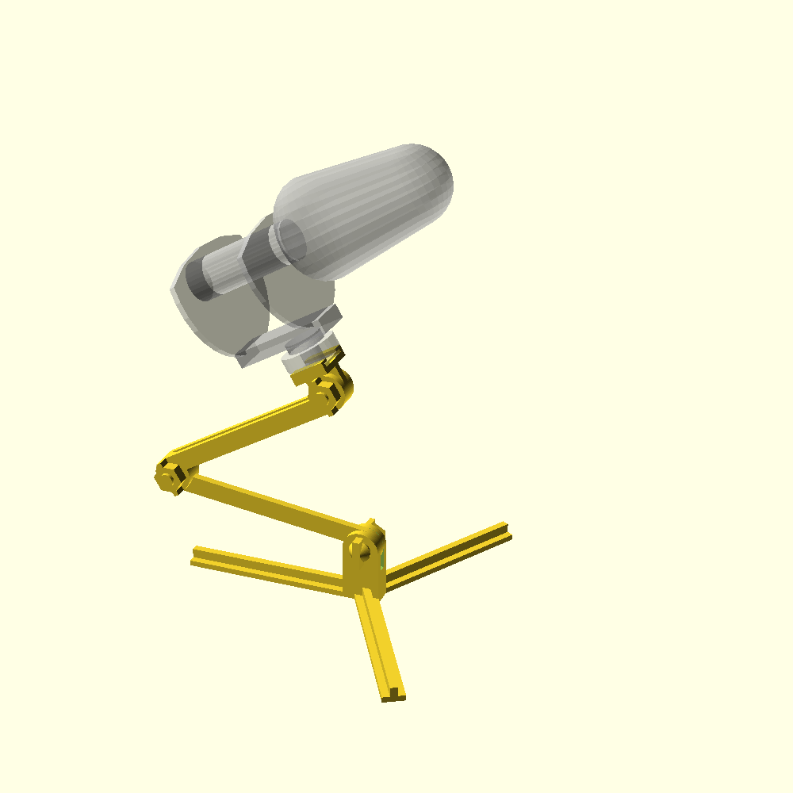

RODE mic holder
===============

Tabletop mic holder for Rode video mic 2.

3D model editing
================

The model is created in OpenSCAD. All the modules are implemented in `holder.scad`.
All separate parts that should be exported as STL individually, marked with
comment `// part`.

Printing
========

STL files are generated for the output parts and saved in `render` folder.
`3mf` project is creted by PrusaSlicer and has print configuration for the parts.
